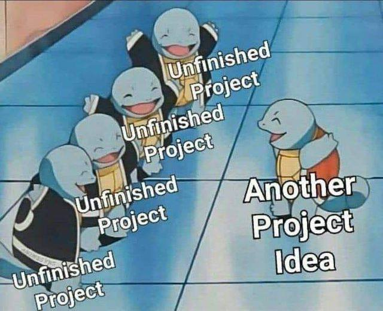
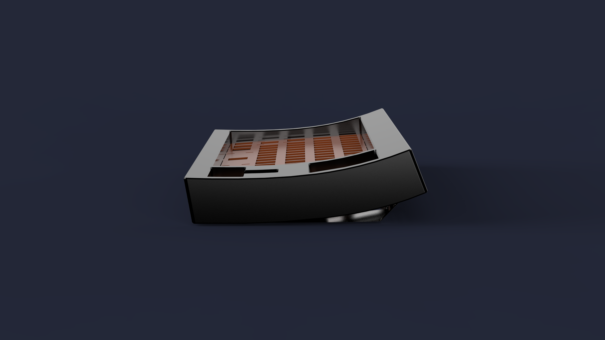
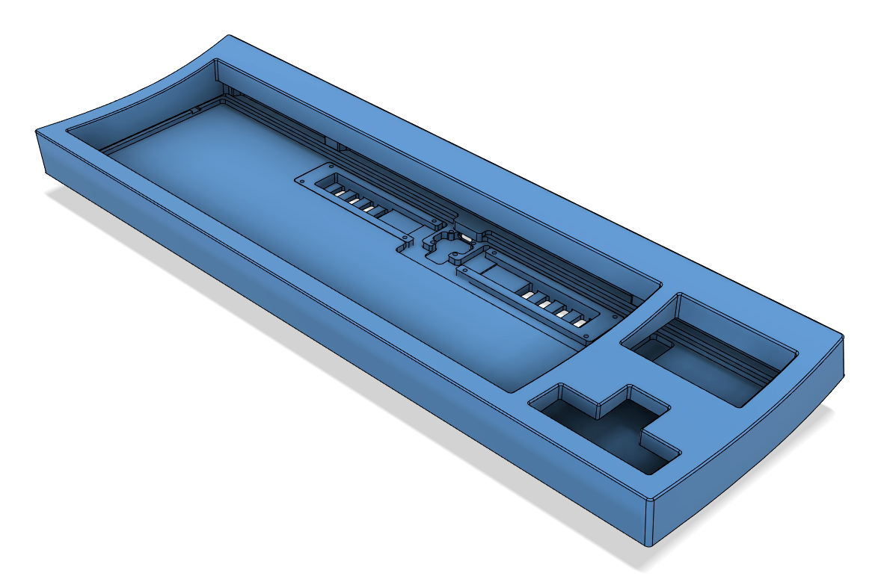
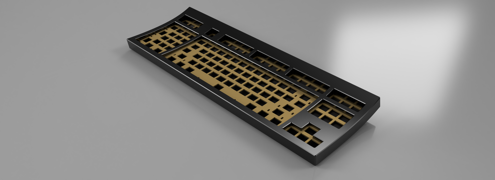
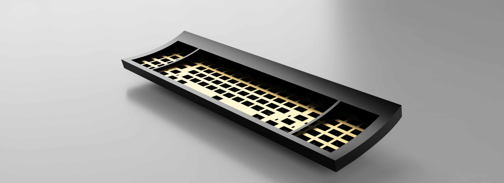
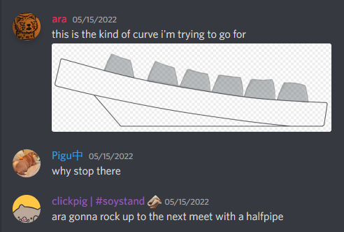

Yeah so this pic said it all, but I swear it's a board this time and not just a pcb

*pic credit to Pat from TapTap discord, who stole it off reddit*

 
 

### Anyways it's an AEK

 

**FRL** (current): i cry every time i look at the manu quote price for the top

*pic from rev 4 rendered in keyshot with copper alps plate*

*pic from rev 4 rendered in fusion*

*internal pic from rev 4 in fusion, without the backplate*

FRL cuz i cbf dealing with aek and normal caps f row height differences. 4 deg typing angle

 

**Southpaw** (on hold): rip wallet

*pic from rev 1 render*

 
 

### Extras

**initial cursed FRL southpaw design**. glad i ditched it

 
 

### Progress

Southpaw: on hold

FRL:
- case: pretty much done at this point
- pcb: might just rip off harky's pcb
- plate: too lazy to finish

TODO:
- solenoid: compartment is done, need pcb for it
- beeper
- ~~(maybe) internal weight~~: 2 internal weights at the solenoid compartments
- ~~(maybe) daughterboard~~: done
- find amber alps

 
 

Also credit to clickpig for naming this board "**halfpipe**". Damn the original drawing in paint was bad

Credits to:
- all snazgs memebers: phoenix (for board hunting & designing), wren (for everything alps and vints), harky (for pcb), josh (for pcb and the cursed contra), veebee (them for pcb and case designs), clickpig (for the name lmao), gok (for some design inputs), awwyaeh (for some design inputs), and pigu (for being good lad), along with many other good lads (including tragic and grump yes)
- ai03's keyboard atelier members: zlane (for some advise and tutorials), oreo (for aek project)
- blacksimoan server members: bitten eite (for solenoid recoomendations), simoan (for the server), the recap team (for blacksimon.tv/recap), and the weeb-nsfw posters

Engravings (potentially):
- theremingoatimpersonator.com
- :peeposmiel: (slightly tilted)
- prototype_7frl 'halfpipe'
