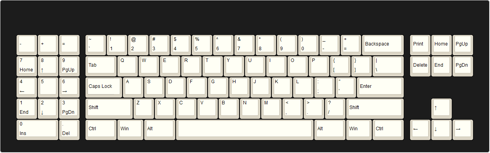

Yeah so this pic said it all, but I swear it's a board this time and not just a pcb

*Pic credit to Pat from TapTap discord, not sure where he got this one from*

Anyways it's an AEK

Trying to somehow fit both aek 0° pcb and mx 7° pcb but keeping a tight top piece cutout. More layouts to come. Gotta fix aek plate file first cuz it's fucked but cbb to generate another file

Also credit to Clickpig for naming this board **halfpipe**. Damn the original drawing in paint was bad

