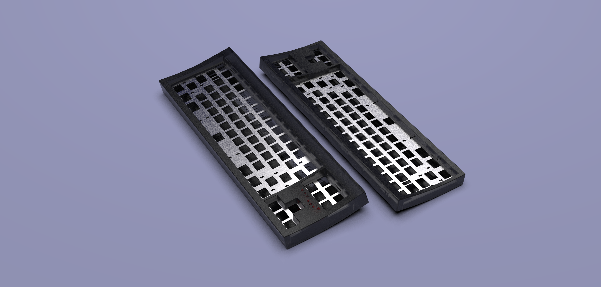
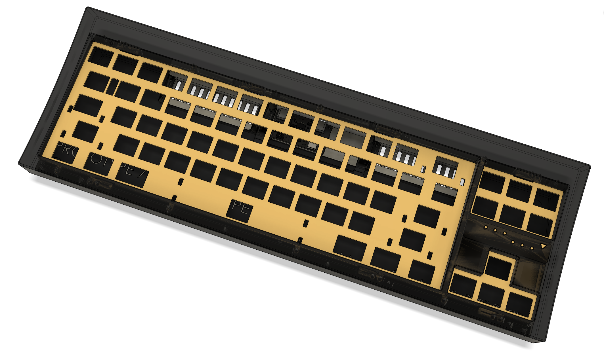

Yeah so this pic said it all, but I swear it's a board this time and not just a pcb

*pic credit to Pat from TapTap discord, who stole it off reddit*

 
 

### FRL

It's an FRL cuz cbf dealing with aek f row. This is like **rev 5** of the design now

pics rendered from keyshot with a *sekrit tm* design

pics from fusion. can somewhat see the mounting points and the db from the pic

 
 

### Progress
- case: pretty much done at this point
- solenoid: solenoid compartment done, solenoid driver and power delivery circuitry still sus af, db compartment kinda done
- backplate: done
- alps pcb: routing and schematic done, just need to put in the reference for the diodes and any bit of clean up left
- alps plate: probably done
- SI pcb: routing and schematic done, just need to put in the reference for the diodes and any bit of clean up left
- SI plate: not started yet, probably easy (just need to figure out stabs mount)

TODO:
- find amber alps
- find sussy aek for the caps
- make sure stuff work
- buy solenoids
- cry looking at wallet

 
 

Also credit to clickpig for naming this board "**halfpipe**". Damn the original drawing in paint was bad

Credits to:
- all snazgs memebers: phoenix (for board hunting & designing), harky & joshajohnson (for pcb), veebee (them for pcb and case designs), gok & awwyaeh (for some design inputs), pigu (for being good lad, please come back dude), clickpig (for the name lmao, and being good lad), along with many other good lads
- ai03's keyboard atelier members: zlane (for some advise and tutorials), oreo (for aek project)
- blacksimoan server members: bitten eite (for solenoid recoomendations), simoan (for the server), the recap team (for blacksimon.tv/recap), and the weeb-nsfw posters, and the vints channel regulars

Engravings (potentially):
- theremingoatimpersonator.com
- :peeposmiel: (slightly tilted) for pigu
- prototype 7frl 'halfpipe'
- ara original artisanal design craft work studio tm r c sm

Old pics of prev designs, see prev commits or the pics/old folder