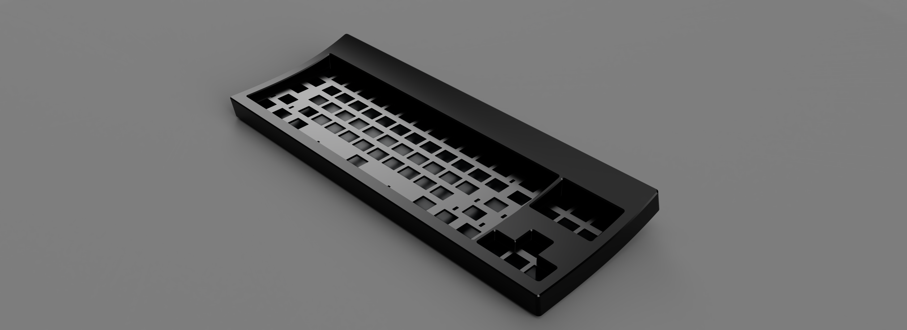

Yeah so this pic said it all, but I swear it's a board this time and not just a pcb

*Pic credit to Pat from TapTap discord, not sure where he got this one from*

I'll update the repo properly 1 day when i've decided which direction i'm going with the board

 
 

### Anyways it's an AEK

~~Trying to somehow fit both aek 0° pcb and mx 7° pcb but keeping a tight top piece cutout. More layouts to come. Gotta fix aek plate file first cuz it's fked but cbb to generate another file~~ Might have to fit 2° aek with 5° standard, 0 and 7 is too extreme for most keycaps profile

 
 

### Also might be considering other layouts instead cuz the og layout is very cursed

**FRL** (Looks kinda nice tbh. And i'm biased but i like it more than other frls)

**Southpaw** (I want this but i'm also not jono so i'm not dropping 5k on a proto)

 
 

Also credit to clickpig for naming this board "**halfpipe**". Damn the original drawing in paint was bad

